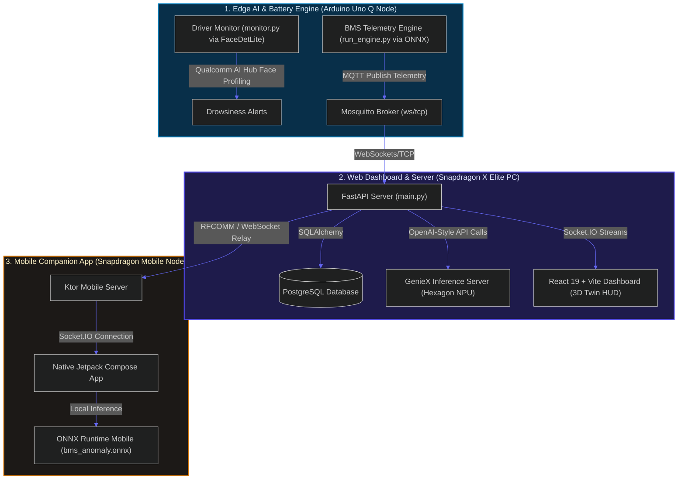

# 🔋 EV Guardian (Trust Cell AI) — Multi-Platform AI-Powered Battery Safety & Intelligence Platform

<div align="center">


**The industry's first offline-first, multi-platform, predictive safety ecosystem for Electric Vehicles.**  
*Leveraging edge computing to prevent thermal runaway disasters, analyze cell drift, and track driver drowsiness in real time.*

[Explore Architecture](#-system-architecture) • [Setup from Scratch](#-setup--installation-instructions-from-scratch) • [Dependencies](#-dependencies-required) • [Run and Usage](#-run--usage-instructions) • [Testing Suite](#-tests--verification)

</div>

---

## ⚡ Project Description (Executive Overview)

Traditional Battery Management Systems (BMS) are passive telemetry-loggers, reporting surface temperatures only after thermal anomalies or cell issues have already progressed. **EV Guardian** rewrites this paradigm. 

By creating a unified edge loop between low-power edge monitors, a high-throughput Snapdragon PC host dashboard, and a Snapdragon-powered Android app, we execute real-time AI and physics-informed models locally on device NPUs. The system detects cell anomalies, calculates state-of-health degradation, monitors driver gaze and drowsiness, and guides the user via an offline voice assistant—fully offline, without cloud latency or security risks.

### Key Capabilities:
- **🔋 Predictive Battery Intelligence:** Evaluates State-of-Health (SOH), Remaining Useful Life (RUL), and runs local LSTM and Sensor Autoencoder models for early fault detection.
- **🛡️ Sensor Trust Engine:** Validates incoming sensor telemetry to detect faulty or drifting sensors, dynamically bypassing corrupted channels with PINN (Physics-Informed Neural Network) virtual models.
- **👁️ Driver Ocular Monitoring:** Captures facial cues using Qualcomm AI Hub models (`FaceDetLite`, `FaceAttribNet`) locally on edge devices to alert drivers of fatigue or distraction.
- **🤖 On-Device Edge AI Assistant:** Features a local LLM (Qwen 3 0.6B) running on the Snapdragon Hexagon NPU via **GenieX** to answer diagnostics queries offline.
- **🌐 3D Digital Twin HUD:** Renders a virtual representation of the battery pack, highlighting individual cell temperatures, voltages, and warning codes in real time.

---

## 👥 Team Members

- **Monishwaran R** — [monishwaran96@gmail.com](mailto:monishwaran96@gmail.com)
- **Prasad Rangaraj** — [prasad.rangaraj@gmail.com](mailto:prasad.rangaraj@gmail.com) | [prasad@crayond.co](mailto:prasad@crayond.co)
- **Boomika** — [boomikas2007@gmail.com](mailto:boomikas2007@gmail.com)
- **Sujan Durai** — [sujanduraisujan@gmail.com](mailto:sujanduraisujan@gmail.com)
- **Priya Dharshini S** — [pavipriya507@gmail.com](mailto:pavipriya507@gmail.com)

---

## 🔄 System Architecture

The EV Guardian ecosystem orchestrates edge telemetry, host coprocessors, and mobile clients into a real-time diagnostics loop.



---

## 🔌 Dependencies Required

To setup and compile the multi-device environment, the following runtimes and services are required:

### 1. System Requirements & Infrastructure
- **Python 3.10+** (with `pip` and virtualenv support)
- **Node.js (v18+)** & npm
- **JDK 17** & Gradle
- **Android Studio**
- **PostgreSQL Database** (locally running on port `5432` with an active database named `evguardian`)
- **Mosquitto MQTT Broker** (running locally on port `1883` or defaulting to `ws://test.mosquitto.org:8080`)

### 2. Module Python & Node Packages

#### A. Web Dashboard Server (`Qualcomm Snapdragon X Elite pc/server`)
Defined in [requirements.txt](file:///d:/ev_guardian/Qualcomm%20Snapdragon%20X%20Elite%20pc/server/requirements.txt):
- `fastapi`, `uvicorn[standard]`, `python-socketio`, `paho-mqtt==2.1.0`, `sqlalchemy`, `psycopg[binary]`, `pydantic`, `pydantic-settings`, `google-genai`, `python-dotenv`

#### B. Driver Monitor Node (`Qualcomm Arduino Uno Q/driver_monitor`)
Imports inside [monitor.py](file:///d:/ev_guardian/Qualcomm%20Arduino%20Uno%20Q/driver_monitor/monitor.py):
- `opencv-python`, `torch` (PyTorch), `numpy`, `pillow` (PIL), `qai-hub-models` (Qualcomm AI Hub models runtime)

#### C. Integrated BMS Engine (`Qualcomm Arduino Uno Q/integrated_bms_engine(optimised)`)
Defined in [requirements.txt](file:///d:/ev_guardian/Qualcomm%20Arduino%20Uno%20Q/integrated_bms_engine(optimised)/requirements.txt):
- `numpy`, `pandas`, `joblib`, `onnxruntime`, `xgboost`, `scikit-learn`, `paho-mqtt`

#### D. Mobile Ktor Server (`Qualcomm Snapdragon Mobile/server`)
Configured in [build.gradle.kts](file:///d:/ev_guardian/Qualcomm%20Snapdragon%20Mobile/server/build.gradle.kts):
- `io.ktor:ktor-server-core-jvm`, `io.ktor:ktor-server-netty-jvm`, `org.jetbrains.exposed:exposed-core`, `org.postgresql:postgresql:42.6.0`, `org.eclipse.paho.client.mqttv3`

#### E. Android App Client (`Qualcomm Snapdragon Mobile/client`)
- Jetpack Compose libraries, `onnxruntime-android` (v1.20.0 for HTP NPU acceleration), Socket.IO Java Client

---

## 🚀 Setup & Installation Instructions (From Scratch)

### 1. Web Dashboard & Server (`Qualcomm Snapdragon X Elite pc`)

#### A. Python Server Configuration
1. Open a command line interface and navigate to the directory:
   ```bash
   cd "Qualcomm Snapdragon X Elite pc/server"
   ```
2. Create and active a Python virtual environment:
   ```bash
   python -m venv venv
   # On Windows:
   .\venv\Scripts\Activate.ps1
   # On macOS/Linux:
   source venv/bin/activate
   ```
3. Install the dependencies:
   ```bash
   pip install -r requirements.txt
   ```
4. Create a `.env` file in `Qualcomm Snapdragon X Elite pc/server/` containing:
   ```env
   DATABASE_URL="postgresql://<username>:<password>@localhost:5432/evguardian"
   MQTT_BROKER="mqtt://localhost:1883"
   LLM_MODEL="qwen3:0.6b"
   GENIEX_URL="http://127.0.0.1:8080/v1/chat/completions"
   SARVAM_API_KEY="your_sarvam_ai_api_key"
   ```

#### B. React Dashboard Configuration
1. Open a new console and navigate to the client folder:
   ```bash
   cd "Qualcomm Snapdragon X Elite pc/client"
   ```
2. Install the node packages:
   ```bash
   npm install
   ```

---

### 2. Edge AI & Battery Engine (`Qualcomm Arduino Uno Q`)

#### A. Driver Monitor Configuration
1. Navigate to the directory:
   ```bash
   cd "Qualcomm Arduino Uno Q/driver_monitor"
   ```
2. Setup the python virtual environment:
   ```bash
   python -m venv venv
   # On Windows:
   .\venv\Scripts\Activate.ps1
   # On macOS/Linux:
   source venv/bin/activate
   ```
3. Install the required libraries:
   ```bash
   pip install opencv-python torch numpy pillow qai-hub-models
   ```

#### B. Integrated BMS Engine Configuration
1. Navigate to the folder:
   ```bash
   cd "Qualcomm Arduino Uno Q/integrated_bms_engine(optimised)"
   ```
2. Setup and activate the virtual environment:
   ```bash
   python -m venv venv
   # On Windows:
   .\venv\Scripts\Activate.ps1
   # On macOS/Linux:
   source venv/bin/activate
   ```
3. Install dependencies:
   ```bash
   pip install -r requirements.txt
   ```

---

### 3. Native Android App & Ktor Backend (`Qualcomm Snapdragon Mobile`)

#### A. Mobile Server Ingestion
1. Navigate to the Gradle module:
   ```bash
   cd "Qualcomm Snapdragon Mobile/server"
   ```
2. Compile and package the Java Virtual Machine target:
   ```bash
   ./gradlew build
   ```

#### B. Android App Setup
1. Open **Android Studio**.
2. Select **Open Project** and choose the [Qualcomm Snapdragon Mobile client app](file:///d:/ev_guardian/Qualcomm%20Snapdragon%20Mobile/client/app) directory.
3. Wait for the Gradle build files to resolve and index.
4. Modify `SERVER_URL` in [BmsViewModel.kt](file:///d:/ev_guardian/Qualcomm%20Snapdragon%20Mobile/client/app/src/main/java/com/think360/bms/viewmodel/BmsViewModel.kt) to match your host PC's Wi-Fi network address.
5. Place your optimized diagnostic model in `client/app/src/main/assets/bms_anomaly.onnx`.

---

## 🏃 Run & Usage Instructions

To launch the integrated multi-device ecosystem, execute commands in the following order:

### Step 1: Initialize local Edge AI (GenieX LLM Host)
Wakes up the local NPU to listen for diagnostic queries offline:
1. Install the CLI tool globally:
   ```bash
   npm install -g geniex-cli
   ```
2. Spawn the model runner (downloads weights locally if first run):
   ```bash
   geniex infer Qwen/Qwen3-0.6B-Instruct-GGUF:q4_k_m
   ```
3. Boot the OpenAI compatible local API endpoint:
   ```bash
   geniex serve --host 127.0.0.1:8080
   ```

### Step 2: Start the Web Dashboard Server
1. Navigate to `Qualcomm Snapdragon X Elite pc/server` and active your virtual environment.
2. Start the Uvicorn application:
   ```bash
   uvicorn main:socket_app --reload --port 3001
   ```

### Step 3: Launch the React Frontend Twin
1. Navigate to `Qualcomm Snapdragon X Elite pc/client`.
2. Start Vite:
   ```bash
   npm run dev
   # Or to run as a packed Electron desktop window:
   npm run electron:dev
   ```
3. Access the dashboard UI at `http://localhost:3001`.

### Step 4: Run Driver Drowsiness Camera Feed
1. Navigate to `Qualcomm Arduino Uno Q/driver_monitor` and active your virtual environment.
2. Run the tracking script:
   ```bash
   python monitor.py
   ```
*Press 'q' in the window frame to exit.*

### Step 5: Start the Telemetry BMS Scoring Engine
1. Navigate to `Qualcomm Arduino Uno Q/integrated_bms_engine(optimised)` and activate your virtual environment.
2. Launch the inference engine:
   ```bash
   python run_engine.py
   ```

### Step 6: Connect Mobile Companion App
1. Run the Ktor mobile relay server:
   ```bash
   cd "Qualcomm Snapdragon Mobile/server"
   ./gradlew run
   ```
2. Build and run the Android Application on your Snapdragon device via Android Studio.

---

## 🧪 Tests & Verification

You can verify the operation of the edge nodes using these checkmarks:
1. **Telemetry Stream Check:** Check that the React 3D twin turns red/blue according to simulated temperature shifts.
2. **Offline LLM Validation:** Disconnect your internet connection, click the assistant chat box in the React HUD, and write a diagnostic query. Verify that the GenieX CLI window handles the prefill and decodes the response locally.
3. **Driver Alert Test:** Run `monitor.py` and cover your webcam sensor for 10 frames. Verify that the console prints a drowsiness warning.
4. **ONNX Local Classifier Test:** Turn off your mobile phone's Wi-Fi. Ensure the Android app keeps scoring and updating cell warning banners using its local ONNX runtime environment.

---

## 📄 License

This project is open-source and available to the public under the **MIT License**. For full details, see the root [LICENSE](file:///d:/ev_guardian/LICENSE) file.
